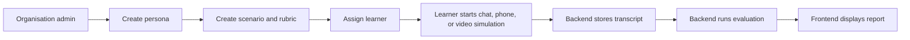

# Squinia Frontend Architecture

This document explains how the frontend fits into the full Squinia platform.

## System Context

Squinia is deployed as two main production services:

- Frontend: Next.js app on Vercel at https://squinia-frontend.vercel.app/
- Backend: FastAPI service on AWS ECS behind an application load balancer

Supporting services include PostgreSQL, Redis, LiveKit, OpenRouter/OpenAI-compatible model providers, Deepgram, Cartesia, Groq, and OpenAI.

## Frontend Responsibilities

The frontend owns the customer experience:

- Authentication screens and logged-in navigation.
- Organisation setup flows for scenarios, rubrics, cohorts, assignments, and personas.
- Persona-aware scenario cards with avatar, name, title, and simulation mode.
- Chat simulation UI with client-side streamed message presentation.
- Phone and video simulation UI using LiveKit client primitives.
- Transcript and recording review pages.
- Evaluation report rendering with scores, examples, and improvement guidance.

The frontend does not perform authoritative evaluation, model orchestration, token creation, or transcript persistence. Those belong to the backend.

## Main User Flow

## Application Shape

The application uses the Next.js App Router. Route groups separate the authenticated dashboard, simulation experiences, and report pages. Reusable UI components keep persona cards, simulation surfaces, transcript blocks, and feedback sections consistent across modes.

Important frontend integration points:

- `NEXT_PUBLIC_API_BASE` points to the backend API.
- `NEXT_PUBLIC_USE_BACKEND_SESSIONS=1` enables backend session persistence.
- The API client centralizes authenticated requests and user-facing error handling.
- LiveKit UI code receives backend-issued tokens and room details.

## Simulation UX

### Chat

The backend returns the completed AI response. The frontend presents that response with a streaming animation to make the conversation feel live without requiring backend streaming infrastructure.

### Phone And Video

The frontend connects to LiveKit using backend-created session details. The UI displays the selected persona avatar, name, and title so the learner knows who they are speaking with. User-facing copy avoids implementation terms such as "LiveKit" and instead uses product language like "Connecting to call".

### Reports

Reports render backend evaluation data. The UI expects:

- Overall score and summary.
- Rubric-level scores.
- Rationale for each criterion.
- Exact learner transcript quotes for "See example".
- Specific improvement guidance for "Show improvement".

## State And Data Boundaries

Backend-backed state is the source of truth for:

- Users and organisations.
- Scenarios, personas, rubrics, cohorts, and assignments.
- Sessions, transcripts, recordings, and evaluations.

Frontend state is used for:

- Current UI mode.
- Optimistic field values.
- Local call controls.
- Client-side display animation.
- Temporary browser-level interaction state.

## Design Principles

- The first screen should be useful, not a marketing placeholder.
- Scenario cards should answer: what is this situation, who will I speak with, and what mode will I practise in?
- Persona presentation should make simulations feel human and specific.
- Error messages should help customers recover without exposing implementation details.
- Report pages should teach the learner what to repeat, what to change, and exactly where that evidence appeared.

## Current Trade-Offs

- Some instructor analytics surfaces still need deeper backend-backed data.
- Frontend test coverage should be expanded around scenario creation, persona upload, and evaluation rendering.
- Visual regression testing is not yet automated.
- Client-side streaming is intentionally a UX animation; true token streaming can be added later if needed.

## Review Talking Points

For peer review, highlight that the frontend is more than a dashboard. It is the learner-facing practice environment, with persona-aware simulation setup, real-time call UI, grounded feedback reports, and production copy aligned to customer expectations.
