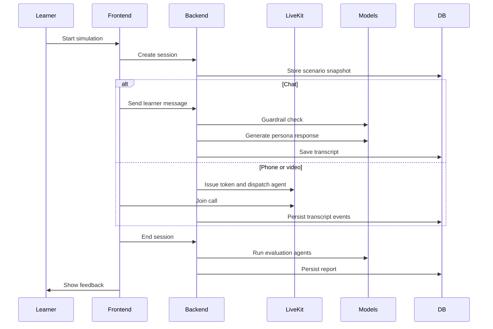

# Squinia Architecture

## System Overview

Squinia is split into a Vercel-hosted Next.js frontend and a FastAPI backend running on AWS ECS behind an application load balancer. LiveKit Cloud handles realtime media. PostgreSQL stores tenants, scenarios, personas, sessions, transcripts, and evaluations. Redis supports cache/session use cases.

## Core Flow

## AI Boundaries

- Chat guard: OpenRouter-hosted guard model for prompt-injection and jailbreak screening.
- Simulation: persona and scenario prompt construction.
- Evaluation: OpenAI Agents SDK pipeline for scoring, evidence extraction, and final review.
- Voice/video: LiveKit agent stack with persona-aware TTS provider fallback.

## Observability Boundaries

- App/API: structured backend logs and `/health`.
- Model workflows: OpenAI tracing for chat and evaluation only; logs capture model, latency, status, and token counts when available.
- LiveKit: realtime call observability remains in LiveKit Cloud and is intentionally not duplicated in the backend traces.

## Production Trade-Offs

- The deployed shape is credible for launch: Vercel frontend, ECS backend, load balancing, managed realtime media, and provider fallbacks.
- Next hardening steps are CI enforcement, end-to-end scenario regression tests, model-quality baselines, dashboards, and alerts on evaluation failure rate and model latency.
