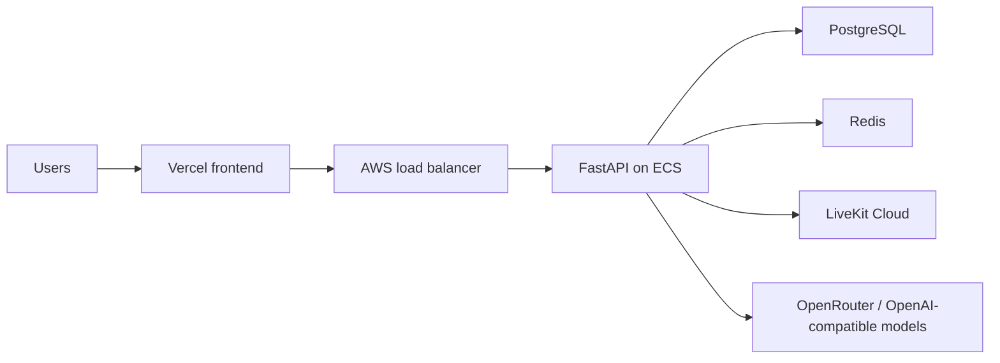

# Squinia

Squinia is a production AI simulation platform for organisations and bootcamps. Teams create realistic interview, escalation, and workplace communication scenarios; learners practise with AI personas over chat, phone, or video; evaluation agents score the transcript and return evidence-backed coaching.

- Live platform: https://squinia-frontend.vercel.app/
- Frontend: Vercel, Next.js
- Backend: AWS ECS behind an application load balancer, FastAPI
- Realtime: LiveKit Cloud
- AI: OpenRouter/OpenAI-compatible models, OpenAI Agents SDK tracing, Deepgram, Cartesia, Groq

## Repositories

- `squinia-frontend`: customer-facing Next.js app.
- `squinia-backend`: FastAPI API, simulation orchestration, transcript persistence, and evaluation jobs.

## Production Shape

## AI System

- Simulation agent: speaks first, stays in the organisation's scenario, and uses the selected persona.
- Chat guard: screens chat input for jailbreak and prompt-injection attempts before generation.
- Evaluation agents: score rubric criteria, select exact learner quotes, produce improvement guidance, and run a final review pass.
- Voice persona: phone/video calls select voice behavior from persona gender and provider fallbacks.

## Observability

- Backend health is exposed through `/health` for the AWS load balancer.
- Backend structured logs include model, provider, latency, status, token counts when available, and evaluation job status.
- OpenAI tracing is scoped to chat and evaluation model workflows only.
- LiveKit call/room/participant telemetry remains in LiveKit Cloud, which is the source of truth for voice/video media observability.

## Review Notes

The project is intentionally framed as a multi-step AI product rather than a single prompt demo: tenant setup, reusable personas, scenario design, real-time simulation, transcript persistence, guardrails, agentic evaluation, and production deployment are separate but connected concerns.
