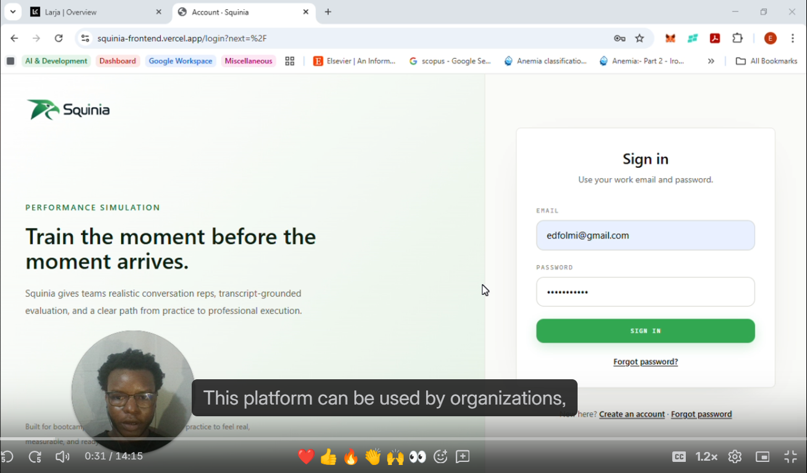

# Squinia Frontend

Squinia is an AI simulation platform for organisations, bootcamps, and training teams to help learners practise interview skills, workplace communication, escalation handling, and professional soft skills in realistic role-play scenarios.

## Demo Walkthrough

[](https://www.loom.com/share/70acd7b5b64044af948d4f1b6cf4be90)

Watch the demo walkthrough showing the platform flow and a live simulation practice session.

## System Design Decisions

**Reviewer note:** after watching the walkthrough, please read [docs/DESIGN-DECISIONS.md](docs/DESIGN-DECISIONS.md). It is a short, skimmable decision log that explains the important system choices, tradeoffs, and "why" behind Squinia, including scenario snapshot fairness, phone/video simulation orchestration, and production infrastructure.

This repository contains the customer-facing Next.js application.

- Live platform: https://squinia-frontend.vercel.app/
- Frontend deployment: Vercel
- Backend deployment: AWS ECS behind an application load balancer
- Backend repository: `../squinia-backend`

## What The Frontend Does

- Organisation onboarding, authentication, and tenant-aware access.
- Scenario, rubric, cohort, assignment, and persona management.
- Reusable AI personas with names, titles, genders, avatar images, voice behavior, and role instructions.
- Learner simulation experiences across chat, phone, and video.
- LiveKit-powered call UI for voice/video simulations.
- Transcript and recording review after simulations.
- Evaluation reports with rubric scores, examples from the learner transcript, and improvement guidance.
- Production-facing copy for loading states, call connection states, and user-facing errors.

## Product Flow

1. An organisation creates personas, rubrics, and real-world scenarios.
2. Learners select a scenario and see who they will practise with before starting.
3. The simulation agent begins the interaction in character, based on the scenario and persona.
4. The learner responds through chat, phone, or video.
5. The backend stores the transcript and generates an agentic evaluation.
6. The frontend renders the transcript and feedback in a review page for learning and coaching.

## Tech Stack

- Next.js App Router
- React
- TypeScript
- Tailwind CSS
- LiveKit client SDK
- Browser APIs for local recording/session UX where appropriate
- Backend API integration through `lib/api.ts`

## Important Environment Variables

Create a local `.env.local` file for development:

```bash
NEXT_PUBLIC_API_BASE=http://127.0.0.1:8888/api/v1
NEXT_PUBLIC_USE_BACKEND_SESSIONS=1
```

For production, `NEXT_PUBLIC_API_BASE` should point to the AWS load-balanced backend API origin.

## Local Development

```bash
npm install
npm run dev
```

The app usually runs at:

```text
http://localhost:3000
```

## Quality Checks

```bash
npm run lint
npm run build
```

If TypeScript-only validation is needed:

```bash
npm.cmd exec tsc -- --noEmit
```

Note: Next.js font optimization can require network access during build if remote fonts are enabled. In restricted environments, use the existing local build setup or run the build in an environment with access to the required font endpoints.

## Demo Path

For a strong peer-review demo:

1. Log in through the live platform.
2. Show organisation setup: personas, scenarios, rubrics, and cohorts.
3. Open a scenario card and highlight persona name, title, avatar, and simulation mode.
4. Run a short chat simulation and show the streamed AI-message UX.
5. Run or show a video/phone session and highlight user-friendly call states.
6. End the session and open the evaluation report.
7. Show transcript, rubric scores, "See example", and "Show improvement".

## UX Principles

- Learners should feel they are practising with a believable person, not a generic bot.
- Scenario cards should make the situation and persona clear before the learner starts.
- System states should use customer-friendly language, for example "Connecting to call" instead of implementation details.
- Feedback should be specific, evidence-based, and tied to the learner's actual words.

## Observability

- Frontend surfaces customer-safe loading and error states; backend logs keep the operational detail.
- Chat and evaluation model workflows are traced through the backend OpenAI tracing setup.
- LiveKit call quality, room, participant, and media telemetry are reviewed in LiveKit Cloud.
- Vercel remains the frontend deployment and runtime visibility layer.

## Known Gaps To Keep Improving

- Expand frontend component and integration tests for persona/scenario flows.
- Add stronger accessibility checks for keyboard navigation and screen-reader labels across all dashboard flows.
- Continue replacing any remaining sample-backed instructor analytics with backend-backed data.
- Add visual regression coverage before major UI releases.
